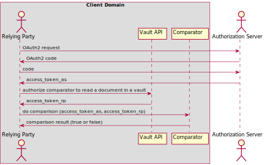
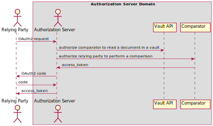

# TODO: Integration Guide

## Purpose of this document

TODO: This document serves as a guide for integrating client software with the TrustBloc _Trusted Selective
Disclosure_ platform that provides permissioned comparisons on protected data without revealing its
contents.

## Overview

The _Trusted Selective Disclosure_ platform allows two parties to securely and privately compare two or more
pieces of data that are encrypted and stored in Vault Servers. Each vault is owned by one party. Comparison
may be evaluated against items in vaults owned by the same party, or against items across vaults owned by
several parties. The latter requires authorization by the other parties.

To perform a comparison:

1. Create a vault using the `Vault Server`
2. Store a document in the new vault in the `Vault Server` (it will be encrypted and stored in a
   [Confidential Storage vault](https://identity.foundation/confidential-storage/))
3. (Optional) Request authorization from the party that owns the other vault
4. Perform the comparison using the `Comparator`

### Creating vaults and storing documents

The Vault Server provides simple RESTful APIs allowing clients to create vaults and store documents
securely in them:

- [OpenAPI Spec](./openapi/vault_server.yaml)

### Relying Parties

Relying parties request authorization to perform a comparison of the contents two or more encrypted documents:

- [Membership Svc: OpenAPI Spec](./openapi/mem_svc.yaml)
- [Comparator: OpenAPI Spec](./openapi/comparator.yaml)

### Authorization Servers

Authorization Servers generate an access_token from the Comparator:

- [Membership Svc: OpenAPI Spec](./openapi/mem_svc.yaml)
- [Comparator: OpenAPI Spec](./openapi/comparator.yaml)

